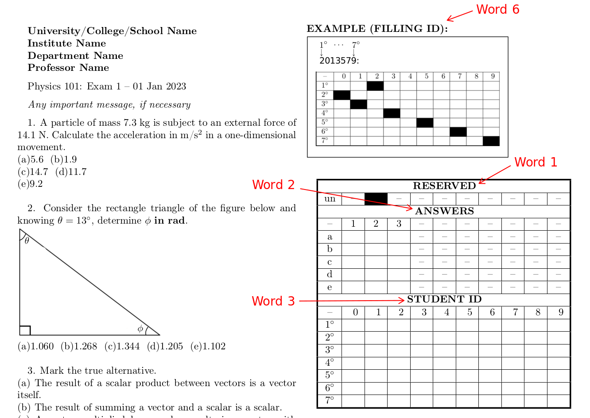
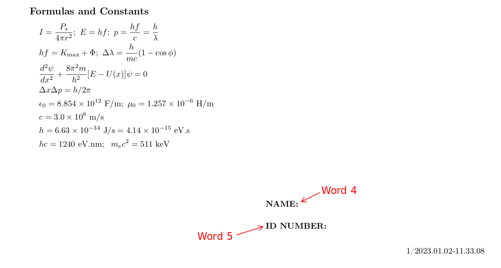
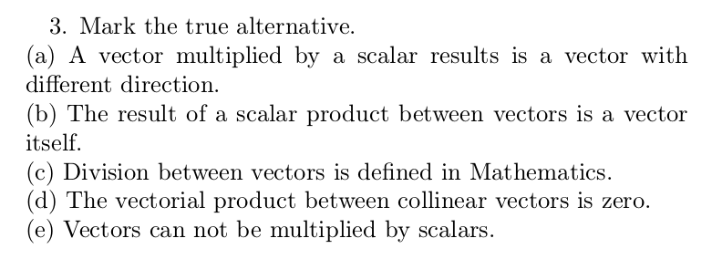
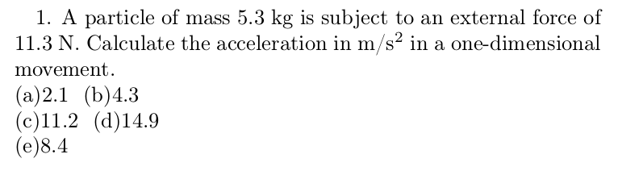
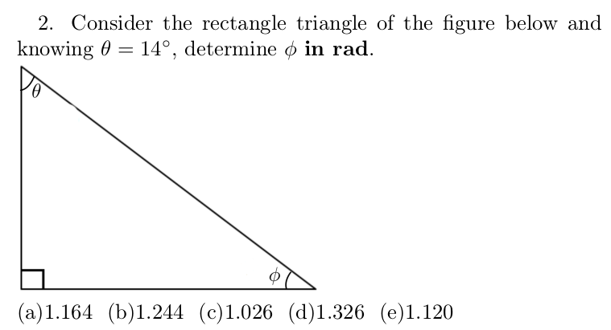

# Exam Generator 

Professors with focus on (but not restricted to) math sciences can generate individualised exams for each student.
Despite the questions are the same, variables and consequently the answers are different. Questions are also shuffled. 
Latex is in charge to beautifully build the PDFs.

Last but not least, an application for correction is included. All you have to do is to scan the exams and provide the images to the Correction application. 
See Usage section for details. The correction code will read the images and extract students answers.Then, it will compare them to the right keys, i.e., it will
perform the correction process itself. Finally, a .csv file report is generated with students scores.

# Dependencies

1. ruby
2. tex-live
3. ImageMagick
4. Ruby gems: mini_magick, date, and csv.

If you are using a debian-based distribution, something like 

`sudo apt-get install ruby ruby-dev texlive-latex-base texlive-science imagemagick`

and also 

`gem install mini_magick csv date`

will solve the aforementioned dependencies. For other distros, please check distro-specific docs for directions.

# Installation

 - Download this project and place the whole folder wherever you want.
 - Note the executable `examgen.sh` expects to be inside the project folder since it assumes all paths as relatives.

# Usage

## Quick Result

If you are in a hurry, and want a quick result, do as follows:

1. Install git (in debian-based distros, do `sudo update && sudo apt install git`)
2. Clone this repo: `git clone https://github.com/abdeoliveira/examgen`
3. Enter the cloned repo: `cd examgen`
4. Run `./examgen.sh 1`

If everything went well a PDF will be opened in your screen containing one sample exam.  

## Quick Start

1. Create questions (try to follow the examples in  `input/questions/`)

## Manual

First, you need to clone this repo (this is the jargon for donwloading a git project). For doing that you need to have [git installed](https://git-scm.com/book/en/v2/Getting-Started-Installing-Git) on your machine. 

Once you have git, cast `git clone https://github.com/abdeoliveira/examgen`

From now on, I will assume `examgen/` as being the root of cloned repo folder. Thus if I referr to `src` or `src/` for example, it means `/path/to/examgen/src`.

The only files you must edit lie inside the `input/config/` folder. They are `formulas`, `header`, `lang`, and `markform`. 

### Configuration (the `input/config` folder)

* `formulas`: This is an OPTIONAL file. If present, it must have N+1 lines, where the first one is a title (as for example, `Formulas` or `Formulas and Constants`) and followed by N lines consisting of equations which you want to provide to students during the test. Equations must follow the `LaTex` format WITHOUT the symbol `$`.

* `header`: This is an OPTIONAL file. If present, it is intented to contain information regarding the School/College/University, Professor, Exam, Date, and whatever information the professor/teacher may find relevant to figure out in the exam header. It must follows the `LaTex` format. Despite it is optional, as stated before, I particularly think it is important to have one.

* `lang`: It is a MUST HAVE file. It must contains a single line with two words separated by a comma as follows: `word1,word2`. `word1` refers to the language used in in your document (`english` for instance). `word2` must be either `point` or `comma` and it stands for the symbol used for decimal separation. For example, the resulting number from the operation `3/2` is represented as `1.5` if `point` is used whereas it is `1,5` if `comma` was choosen.

* `markform`: A MUST HAVE file containing six words or sentences (spaces are allowed) separated by comma, like this: `word1,word2,...,word6`. 
Each word (or sentence) will appear in a different part of the document. See the images below for details.






### Creating questions

Questions must be written in a specific format which will be discussed below. Each question is a single file having the `.gnxs` extension name, and must be located in the `input/questions/` folder. You may want to take a look in example files inside the `input/questions/` folder while reading the following paragraphs. 

Each question file must have 4 blocks, which are `@config`, `@question`, `@figure`, and `@answer`, and must terminate with `@end`.

The number of alternatives for questions is a global variable (all questions must have the same number of alternatives) and will be discussed later.

#### The `@config` block

Must have 2 entries: `mode:` and `inline:`. 

* `mode:` expects one of the following arguments, `numeric` or `text`. `numeric` is intended for questions with alternatives as numbers. 
`text` is intended for questions with alternatives as texts. 

* `inline:` expects an integer number as argment and it stands for the number of alternatives in one line. Something between 5 and 8 do well for `mode:numeric` (e.g. `inline:8`) 
and I recommend `inline:1` for `mode:text`

Check screenshots with the `inline:` variable in action. 

**inline:1** [This is a typical question in `mode:text`. Note that `inline:1` renders a nice visual for such `mode:text` questions.]



-----

**inline:2** [Here we have `mode:numeric`. Note that `inline:2` won't display a great layout for this specific case.]



-----

**inline:8** [Again `mode:numeric`. My recommendation is `inline:8` for a two-columns document with number of alternatives less or equal to 8.]



-----


#### The `@question` block

The only entry is a text following [LaTex](https://www.latex-project.org/) format. Thus equations, bolds, italics, colors and so on, will all follow LaTex format.  

**Note:** If the question is in `mode:numeric` then you will have to deal with the `@VAR()` function. The `@VAR()` function correlates a variable 
to a random number belonging to a user-defined number interval. Such an interval is defined in the `@answer` block. Check the example below. 
```@config

mode:numeric
inline:2

@question

A particle of mass @VAR(m) kg is subject to an external force of @VAR(F) N. 
Calculate the acceleration in m/s$^2$ in a one-dimensional movement. 

@figure

file:none
width:10.0cm

@answer

m:1,10,2
F:10,20,1
correct:$F/$m
minmax:auto,1

@end
```
Here we have `@VAR(m)` and `@VAR(F)` in the `@question` block, which are correlated to `m:1,10,2` and `F:10,20,1` in the `@answer` block (more about
such a block can be found below).

In this example, the final document will have `@VAR(m)` replaced by a random number between `1` and `10` (closed interval) having `2` decimal digits. 
For example, `@VAR(m)` can be `1.43`, `5.40`, `7.21`, `10.00`, and so on.  
As you probably have already antecipated, `@VAR(F)` will be replaced by a random number between `10` and `20` with `1` decimal digit, e.g., `10.0`, `12.5`, `19.9`, and so on.

#### The `@figure` block

Contains two variables, which are `file:` and `width:`. The former expects a figure name as argument, if any. 
If there is no figure in the question, the argument must be `none`. The later expects the figure width as argument, if any. 
If `file:none` then `width:` argument is ignored (although `width:` *must* be present).

File figures must be located in the `input/figs/` folder. My setup works well with the `png` format but you can use any one suitable to `LaTex`.

#### The `@answer` block

This block must have N+2 lines, where N is the number of `@VAR()` functions used in the `@question` block. Each one of the N lines is expected to have the 
following format: `a:b,c,i`, where:

* `a` must be associated to a `@VAR(a)` function, present in the `@question` block.
* `b` is an integer or real number, the lower limit of the interval (closed)
* `c` is an integer or real number, the upper limit of the interval (closed)
* `i` is an integer, and stands for the number of decimal places of `a`.

The last two lines are `correct:` and `minmax:`. 

- `correct:` has the equation for the correct answer and must be composed by the previously defined N variables. 
*Note:* Here each variable must be prepended by the `$` symbol. For example, supposed the answer for a given question is calculated by the formula `F/m` 
(borrowing our previous example). Then the line must be `correct:$F/$m`.

**NOTE 1:** Mathematical functions are expected to follow [Ruby's syntax](https://ruby-doc.org/core-2.6/Math.html). Examples:
 - `sin(x)` is written in Ruby as `Math.sin(x)`
 - `sqrt(x)` is written in Ruby as `Math.sqrt(x)`
 - `2^3` (which is 8) is written in Ruby as `2**3`.
 - `Math::PI = 3.1415...` and `Math::E = 2.7182...`. 

 **NOTE 2:** Real numbers are expected to be written with `.` as decimal separator whatever is your language definitions.

- `minmax:` Defines the interval used to sample numbers to compose the wrong alternatives. It
expects either `auto,i` or `a,b,i` as arguments. `a` and `b` may be integer or real numbers and `i` is an integer.
If `auto` is used then the program will try to guess a reasonble interval for sampling numbers. `i` is the number
of decimal digits. If `a` and `b` are used then the program will respect such a user-defined interval.

**NOTE:** There is a common pitfall for multiple-choice exams. See for example a question asking to calculate the maximum height `H` of an object launched upwards with velocity `v0` from a certain initial heigth `y0` must have an answer `H > y0`. It is possible that certain alternatives will not obbey this condition (due to the way I coded how alternatives are created in `auto` mode) and a keen student will easily spot it. This is a typical case in which the `minmax:`  must *NOT* be used in `auto` mode.

## Running

1. Enter the project folder, `cd examgen`. Then, ensure `examgen.sh` is executable by doing `chmod +x examgen.sh`.

2. Run `./examgen.sh i`, where `i` is the number of exams to be generated.
The script can alternatively be run as `./examgen.sh i j`, where `j` is the number of alternatives for each question. 
If `j` is absent, then `j=5` will be used by default, i.e., questions will have `(a) ... (e)` alternatives.

3. After running `./examgen.sh i`, if everything was fine, a single PDF document containing `i` exams will be opened in your screen. The actual file is `session/output.pdf`.

4. Each exam is stamped (bottom right of each page) with a code like `i/yyyy.mm.dd-hh.MM.ss`, standing for `exam_number/year.month.day-hour.minute.second`.

5. The folder `session/` contains all the necessary information to perform the exam correction (see the next section). In case of accidental
deletion of such a folder there is no way to use the `correction/correction.rb` program to automatically  correct the exams. For few exams (a dozen or so) 
this is not a big deal. On the other hand, for a hundred exams the correction involving shuffled questions and alternatives, and also random numbers
spread all over the place can be a cumbersome task. Thus every time `examgen.sh` is run the `session/` folder is saved as a hidden folder as
`.session_yyyy.mm.dd-hh.MM.ss`. This way you are able to correlate any generated PDF with the folder containg the files necessary for correction. 
`session/` is sanitazed before saved in order to minimize the used space. Thus only the necessary files to perform exam correction are kept along with `.tex` files in case
you need to regenerate any PDF (you will the need files inside `~/input` for that).

6. Regarding the point above, `session/` *IS NOT* saved if `i = 1`, i.e., if you run `./examgen.sh 1`.

7. Ask students to write their name and ID number in the very end of the exam (in the corresponding fiels). This is important to eventually identify missing exams for any reason. 

## Logging

`LaTex` can be quite verbose. All that usual output typically generated by `LaTex` is piped to the `/tmp/examgen-latex.log` file. Note the `/tmp` folder is the one of your system, there is not a `tmp` folder inside `examgen/`.

## Correction

To be written.


### Ignoring questions

For some reason you may want to ignore certain questions during correction. For example, you discovered that there were bugs in some of them. To do so, you need to create the file `/session/qignore` containning the exact question file names, one per line. Like this:

```
question-to-ignore-1.gnxs
question-to-ignore-2.gnxs
.
.
.
question-to-ignore-N.gnxs
```

## Troubleshooting

To be written.


